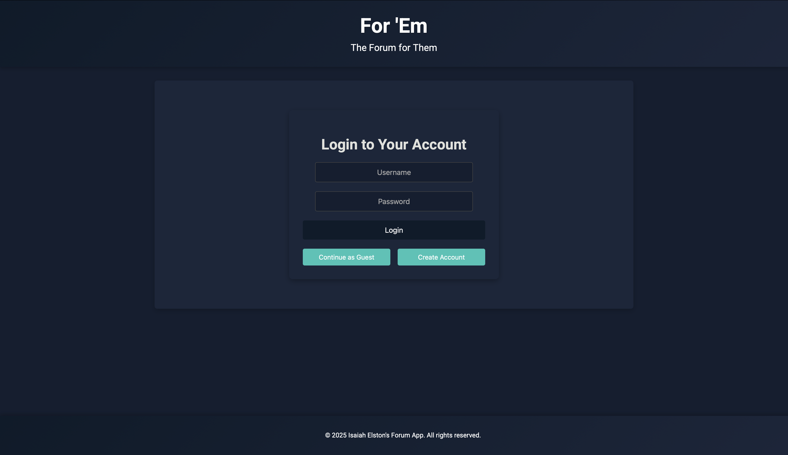
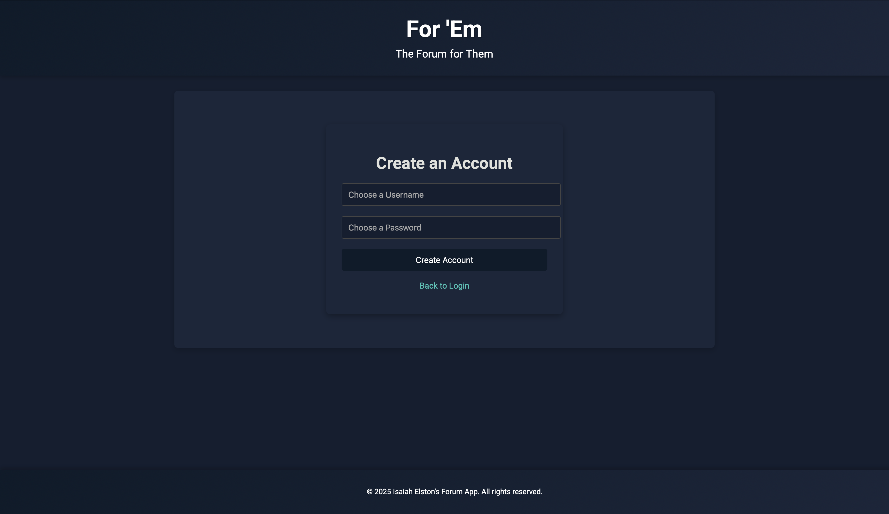
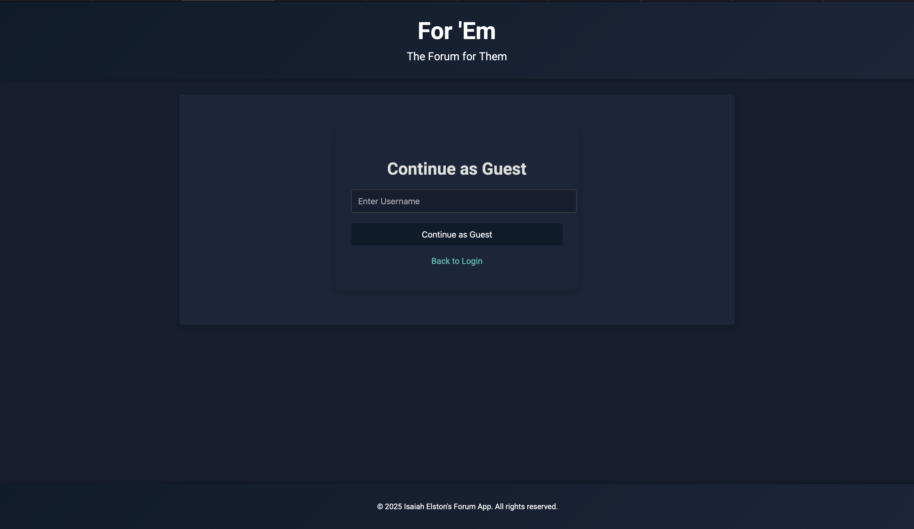
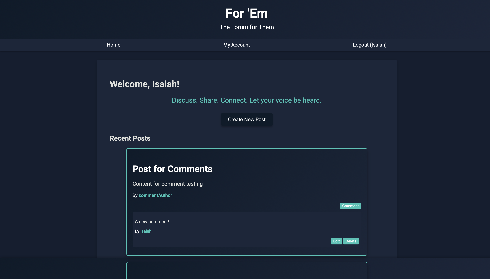
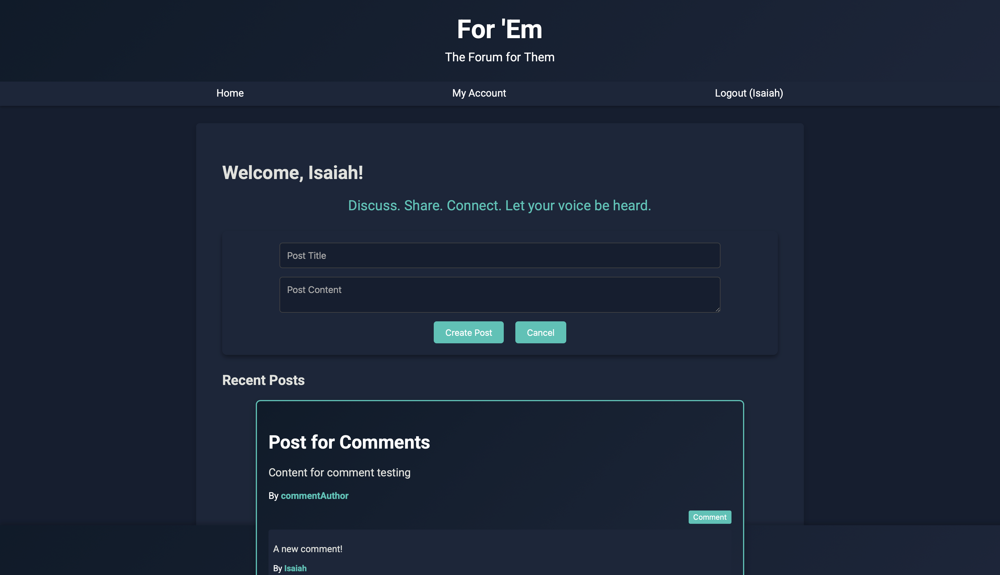
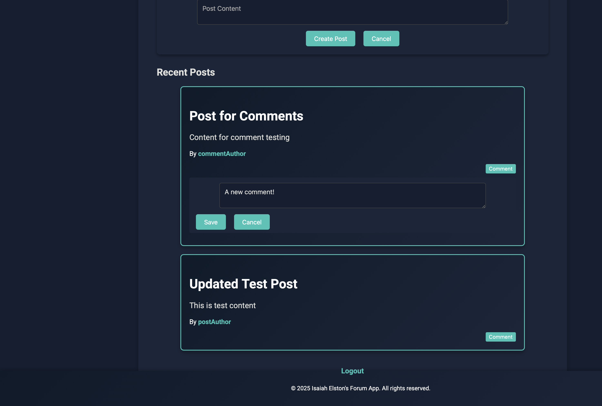

# For 'Em: A Forum Application with API Endpoints

## Isaiah E. Elston

This project was originally built as a project for a course at the University of Wyoming. The goal of the project was to create a social media application that allows users to create accounts, make posts, and then comment on posts. The project required us to implement all the CRUD operations for comments and posts, and I personally opted to implement the CRUD operations for the accounts as well. The project requirements implored me to use Express.js and Handlebars, but the rest was up to me. I decided to use MongoDB as the database with Mongoose as the ODM. The project also required us to implement ReSTful API endpoints for the `User`, `Post`, and `Comment` models. There will be a mobile companion app that utilizes these API endpoints coming soon!

Since the application does not hash any of the information, I have deliberately not provided a database URI in the repository. If you would like to test out the website for yourself, please visit the [MongoDB Atlas](https://www.mongodb.com/atlas) website and create a free account. Then, create a new cluster and database. After that, please follow the **Node.js** instructions for generating a connection string. Finally, create a `.env` file in the root directory of your local clone of the project and add the following line to it: `uri = <your_connection_string>`. Optionally, you can also add a `session_key`, `DB_NAME`, and `PORT` variable to the `.env` file. If you do not want to deal with the setup process, you can also reference the various screenshots and video demonstrations included in the repository.

## Any directions or description needed to use the pages

To start the server, run the following command in the terminal:

```bash
node index.js
```

Then, navigate to `http://localhost:3000` (unless the console outputs a different port number) in your web browser. From there, it will take you to the login screen. Once you have created an account and logged in, you can use the navbar to navigate to the different pages

## Screenshots

### Login Page



This is the login page. You can either log in with an existing account or create a new one. If you want to log in as a guest, you can click the "Login as Guest" button. If a user is unauthenticated, they will always be redirected to this page.

### Register Page



This is the page where users can create new accounts. It requires a username and password. The user is redirected to the home page after successful registration.

### Guest Login Page



This is the guest registration page. It allows users to log in as a guest, meaning they only have a username. The user is redirected to the home page after successful registration.

### Home Page



This is the home page. It displays all the posts and comments. Users can create new posts and comments from this page. The user is redirected to the login page if they are not authenticated. It also has a navbar at the top that allows users to navigate to different pages.

### Post Prompt *(Inline on Home Page)*



This is what it looks like when a user clicks the "Create Post" button. It allows users to create a new post. The user is redirected to the home page after successful post creation.

### Comment Prompt *(Inline on Home Page)*



This is what it looks like when a user clicks the "Create Comment" button. It allows users to create a new comment. The user is redirected to the home page after successful comment creation.

## Project Demonstration(s) *(Video(s))*

I opted to record two separate videos to make it clear what I am depicting and how it works.

### Video 1: Project Walkthrough


This video shows the project in action and how it works accessing it from a web-browser. It demonstrates how to create a new account, log in, and create posts and comments. It also shows how to view all posts and comments.

### Video 2: API Walkthrough


This video demonstrates all the ReSTful API endpoints via a testing file I made. Please refer to the `tests/apis.test.js` file to see precisely how it works. It spawns a server and uses the `supertest` library to create multiple users. Then, it tests the CRUD operations for the `User`, `Post`, and `Comment` models. The video demonstrates that all tests pass and then shows that the database was indeed accessed and modified during the test.
